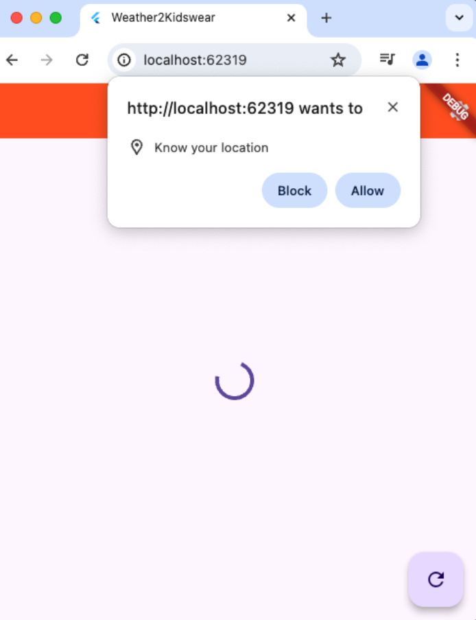
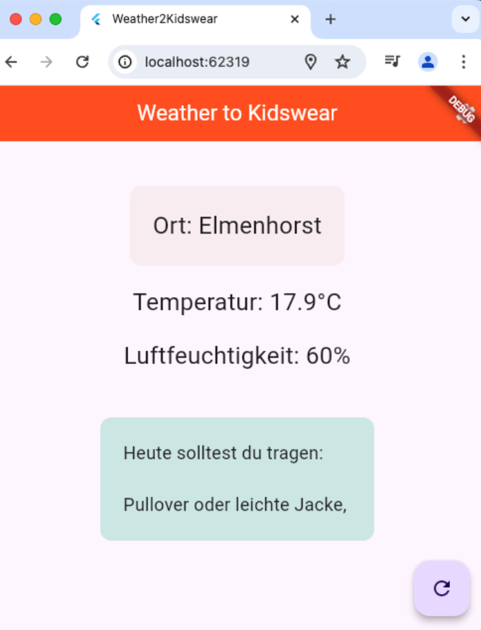

# W2K App

### Beschreibung der App "Weather to Kidswear" - W2K App

"Weather to Kidswear" ist eine Wetter-App speziell für Kinder. Diese App bietet aktuelle Wettervorhersagen und gibt basierend auf den Wetterbedingungen Empfehlungen für die passende Kleidung. Durch die Nutzung von GPS-Daten bestimmt die App den aktuellen Standort des Kindes und liefert genaue Wetterdaten sowie Vorschläge wie zum Beispiel: "Zieh eine warme Jacke an" oder "Vergiss den Regenschirm nicht". Die App zeigt auch die Temperatur, die Luftfeuchtigkeit und andere wichtige Wetterinformationen an. "Weather to Kidswear" ist einfach zu bedienen und verwendet farbenfrohe Grafiken, um das Interesse der Kinder zu wecken.

  
|  |  |
|--|--|
|  |  |

## Von pub.dev verwendete Pakete

- flutter_svg
- geocoding
- geolocator
- http
- logger
- provider
- shared_preferences

Weather API from Open-Meteo
https://open-meteo.com/

Geocoding API from OpenCage
https://opencagedata.com/

